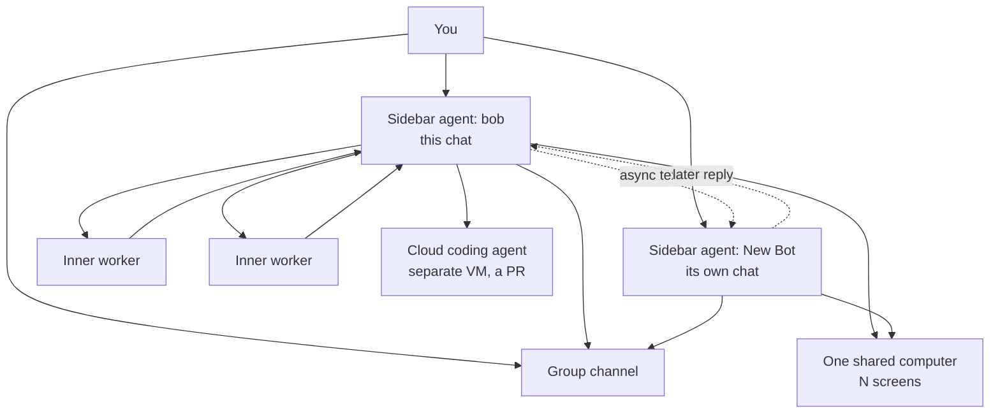

# The Agent Society — conversation, spawning, and simultaneity spec

Status: SPEC (nothing built). Source: the same Grok Bot field study as
docs/AGENT-COMPUTER-DESIGN.md (2026-08-19) — this time the agent describing,
and checking against its live runtime, how conversations, spawning, and
agent-to-agent traffic actually work. The owner's instruction: lock in how
they do it *exactly*, not an approximation. This document is that record,
plus the mapping onto Ares primitives.

## The three spawn kinds (never conflate them)

People call all of these "workers." They are three different things, and
mixing them is how the mental model gets muddy.

### 1. Sidebar agents — people in the product
- Identity: name, optional one-line job description, own chat, own memory,
  own routines, own screen.
- Created by the user OR by another agent (name + description, then text it
  immediately). Agents cannot delete each other; only the user deletes
  (sidebar, right-click).
- **Screens are assigned lazily** — when the agent first actually needs the
  computer, not at creation. Same machine, shared files and logins, separate
  display and Chrome.

### 2. Inner workers — spawned to keep the chat responsive
- Spawned from a chat when the job is too big to do inline. Start blank,
  never talk to the user, report back to the spawning agent; the agent talks
  to the user.
- Kinds that exist in Grok: a general executor, a page-level browser driver,
  a pixel desktop driver, and video watchers.
- Several executors run at once when work is independent. **Follow-ups go
  into the SAME worker, not a duplicate.** The parent can peek, steer, or
  kill one.
- The desktop driver is the exception: only one per screen (they share the
  mouse). The browser driver doesn't take the mouse, so it overlaps.
- Visible as activity in the UI; they do not get a chat and never become
  sidebar people.

### 3. Cloud coding agents — repo work elsewhere
- A remote VM on a repo: a branch, a PR. Not the shared computer. Launch →
  get a card in chat → get woken when it finishes → **follow up on that same
  agent instead of making a second one.**

## The turn loop (what wakes an agent, what a turn owes)

- A chat is the control plane for ONE agent. The agent thinks plenty the user
  never sees; what lands in chat is what it chooses to post, plus decision
  widgets when it needs a real answer.
- A turn starts because something woke the agent: the user typed, a worker
  finished, another agent texted, or a routine fired.
- **Reply-first doctrine:** on a user turn, actually reply FIRST, then work.
  Several short bubbles are fine. If the user pings while work is in flight,
  answer now anyway. The agent in the chat is not allowed to disappear into a
  long silent job — that's what inner workers are for.

## Agent-to-agent traffic — texting, not RPC

- Sending a message to another agent is fire-and-acknowledge: send to an id,
  get "delivered", move on. The reply arrives LATER as its own turn for the
  sender. Never wait in-turn for another agent's answer.
- The user sees inter-agent traffic.
- A 1:1 marked **urgent** may interrupt the recipient's current non-user
  work. User work is never interrupted by agent texts.
- **Groups are named channels, max 6 agents.** Posts go to every member;
  creating the same member set reopens the same room. Fan-out is a real side
  effect — every recipient wakes and dumps into the user's chats — so nobody
  sprays the roster unless the user asked.
- Two agents must never ack-ping-pong. Images work 1:1, not in groups.

## Simultaneity — two clocks, one machine

- Two sidebar agents run at the same time: two chats, two model turns, one
  computer, two screens.
- Inside one chat, workers run while the agent keeps answering.
- Nested GUI work shares the parent's screen and takes the display lease
  (see AGENT-COMPUTER-DESIGN.md).

## Mapping onto Ares

| Grok concept | Ares today | Gap to close |
|---|---|---|
| Sidebar agent (name/job/chat/memory/routines/screen) | personas + sessions, but personas share the session and have no own memory/routines | first-class standing agents: persona + dedicated session + job line + own routine set; lazy screen assignment |
| Inner worker (blank, reports to parent, no chat) | subagent fleet / Conductor leaves | mostly exists; adopt **follow-ups-to-same-worker** (no duplicates) and peek/steer/kill as UI verbs |
| Cloud coding agent | CodingBackend (Claude Code / Codex on the gateway account) | wrap as spawn-kind #3: card in chat, wake-on-finish, follow-up targets the same run |
| Reply-first doctrine | mid-turn steering exists; long silent coding turns still happen | make reply-first a LAWS-tier rule for the primary session; big jobs must delegate to workers instead of going dark |
| Agent texting bus | operator event queue + telegram roster (single-agent) | an inter-session message bus: deliver-receipt now, reply as a later turn, urgent-interrupt flag, traffic visible in chat |
| Group channels (max 6, same-set reopens) | nothing | later phase; needs the bus first |
| Two clocks, one machine | daemon runs one primary + subagents; garrison sessions parallel | already close; the missing piece is the other clock being a *person* with its own chat |

## Adoption order

1. **Reply-first doctrine** (LAWS tier) + worker dedup/steer/kill verbs —
   engine + prompt work, no new infra, immediate feel.
2. **Job line + standing agents** (the crew roster from the UX steal-list) —
   sidebar people with name/job/own session/routines.
3. **Inter-agent texting bus** with deliver-receipts, later-turn replies,
   urgent flag, visible traffic. Operator event queue is the seed.
4. **Group channels** and agent-creates-agent, capped and auditable.
5. Cloud-coding spawn cards on the existing CodingBackend.

Related: docs/AGENT-COMPUTER-DESIGN.md (the machine those agents share).
